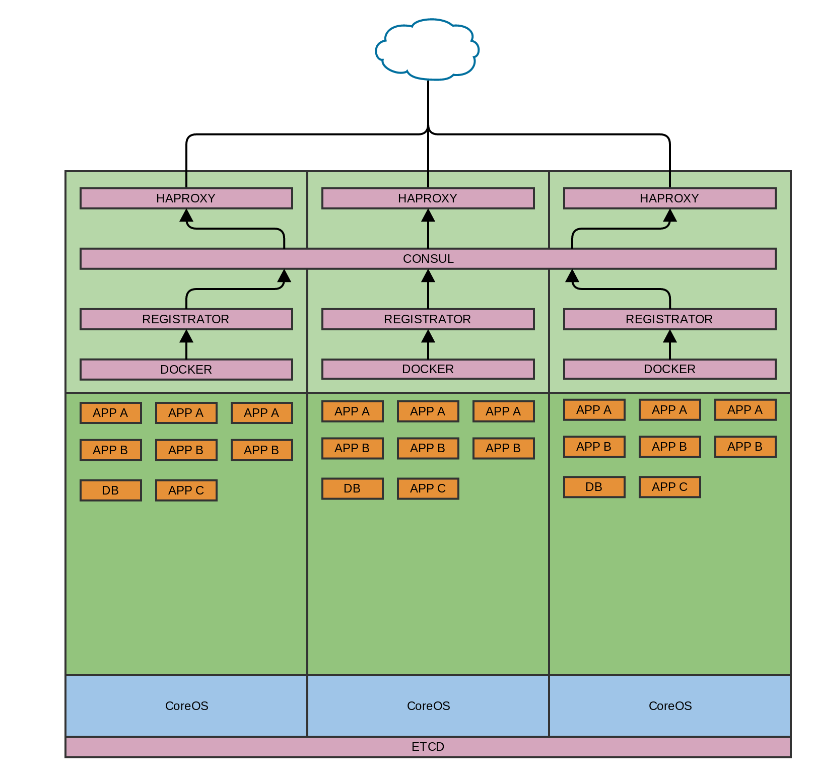

Colossus Platform
=================

Colossus is platform to run distributed services using containers.

Components
----------

The Colossus is comprised of the following components:

* CoreOS - The Operating System
	* Etcd - The Distributed key-value store
	* Fleet - The Distributed init System
* Consul - The Service Discovery
	* Registrator - The Docker Bridge
	* HAProxy - The Proxy & Load Balancer
* Docker - The Container Runtime



For more details about each component check [architecture](https://github.com/harbur/colossus/tree/master/docs/architecture)

Installation
------------

To Install Colossus follow these Steps:

* [Create a Coreos Cluster](https://coreos.com/os/docs/latest/booting-on-ec2.html)
* [Install Harbur CLI](http://docs.harbur.io/en/latest/installation/harbur-cli/index.html)
* [Configure Virtual IP](https://github.com/harbur/colossus/tree/master/docs/VIP)
* [Configure Wildcard DNS](https://github.com/harbur/colossus/tree/master/docs/DNS)
* [Launch Consul in CoreOS Cluster](https://cloud.harbur.io/unitfiles/harbur/consul)
* [Launch Registrator in CoreOS Cluster](https://cloud.harbur.io/unitfiles/harbur/registrator-consul)
* [Launch HAProxy in CoreOS Cluster](https://cloud.harbur.io/unitfiles/harbur/haproxy-consul)
* [Configure Docker DNS Search](https://github.com/harbur/colossus/tree/master/docs/dockerDNS)

## Using Colossus

## Run Redis Server

Connect to a node with SSH and run:

```shell
core@coreos1 ~ $ docker run --name redis_server -d -p 6379:6379 redis
```

This will start a redis server in the node. Registrator will pick-up the container creation event and register it to Consul Backend. You can verify that at the Consul UI (http://cluster.local:8500/)

Since Consul is your DNS server on the cluster, all services are now discoverable by DNS. To verify that go to **another node** and run:

```shell
core@coreos2 ~ $ ping redis.service.consul
PING redis.service.consul (10.0.0.100) 56(84) bytes of data.
64 bytes from coreos1.node.dc1.consul (10.0.0.100): icmp_seq=1 ttl=64 time=0.294 ms
```

For more information about the Consul DNS discovery review [Consul DNS Interface](https://www.consul.io/docs/agent/dns.html)

This also works inside a container as expected:

```shell
core@coreos2 ~ $ docker run --rm -it redis ping redis.service.consul
PING redis.service.consul (10.0.0.100): 48 data bytes
56 bytes from 10.0.0.10: icmp_seq=0 ttl=64 time=0.151 ms
```

Since we configured the [Docker DNS Search](https://github.com/harbur/colossus/tree/master/docs/dockerDNS) The service is also discoverable using just the service name:

```shell
core@coreos2 ~ $ docker run --rm -it redis ping redis
PING redis.service.consul (10.0.0.100): 48 data bytes
56 bytes from 10.0.0.100: icmp_seq=0 ttl=64 time=0.187 ms
```

Let's connect a redis client and write a message from the 2nd node:

```shell
core@coreos2 ~ $ docker run --rm -it redis redis-cli -h redis
redis:6379> set hello world
OK
```

And let's connect a redis client and read a message from the 3rd node:

```shell
core@coreos3 ~ $ docker run --rm -it redis redis-cli -h redis
redis:6379> get hello
"world"
```

To cleanup the demo, run the following on the 1st node:

```
core@coreos1 ~ $ docker kill redis_server
redis_server
core@coreos1 ~ $ docker rm -v redis_server
redis_server
```

**NOTE**: As seen on the example, the DNS discovery resolves the service hostnames using the Private IP of the host machine. This means that the port needs to be fixed and exposed to the host machine. That is why we run the redis server with `-p 6379:6379`.

## Run an Nginx Service

Now we'll see an another approach for service discovery, using the HAProxy backed by Consul. This is used for external discovery and scales better since it doesn't have the requirement to fix the port to specific host port.

```shell
$ docker run -d -p 80 -e SERVICE_NAME=example nginx
```

**NOTE**: [SERVICE_NAME](http://gliderlabs.com/registrator/latest/user/services/#service-name) variable can configure the name of the given service.

Open http://example.cluster.local to see the nginx server.

The process is the same as before, but now we use an additional layer: The HAProxy backed by Consul. On port 80 the HAProxy service is running. It uses Consul-template to monitor Consul and update HAProxy on-the-fly.

To check the HAProxy configuration after running nginx do:

```shell
docker exec haproxy-consul cat /haproxy/haproxy.cfg
...
    acl host_example hdr(host) -i example.cluster.local
    use_backend example_backend if host_example
...
backend example_backend

   server coreos1 10.0.0.100:32769
...
```

As shown the haproxy is now configured to resolve `example.cluster.local` to `example_backend` which points to the `PRIVATE_IP:EXPOSED_PORT` of that specific container.

If we run two instances of the same nginx server on the 2nd node:

```shell
docker run -d -p 80 -e SERVICE_NAME=example nginx
docker run -d -p 80 -e SERVICE_NAME=example nginx
```

We'll see that the traffic goes to all three instances:

```shell
docker exec haproxy-consul cat /haproxy/haproxy.cfg
...
    acl host_example hdr(host) -i example.cluster.local
    use_backend example_backend if host_example
...
backend example_backend

   server coreos1 10.0.0.100:32769
   server coreos2 10.0.0.101:32776
   server coreos2 10.0.0.101:32775
...
```

Stop the first server and refresh the web page to see that requests are now redirected to the 2nd node automatically.

License
-------

Copyright © 2015 Harbur Cloud Solutions LC.

Licensed under the Apache License, Version 2.0 (the "License").

Unless required by applicable law or agreed to in writing, software distributed under the License is distributed on an "AS IS" BASIS, WITHOUT WARRANTIES OR CONDITIONS OF ANY KIND, either express or implied. See the License for the specific language governing permissions and limitations under the License.